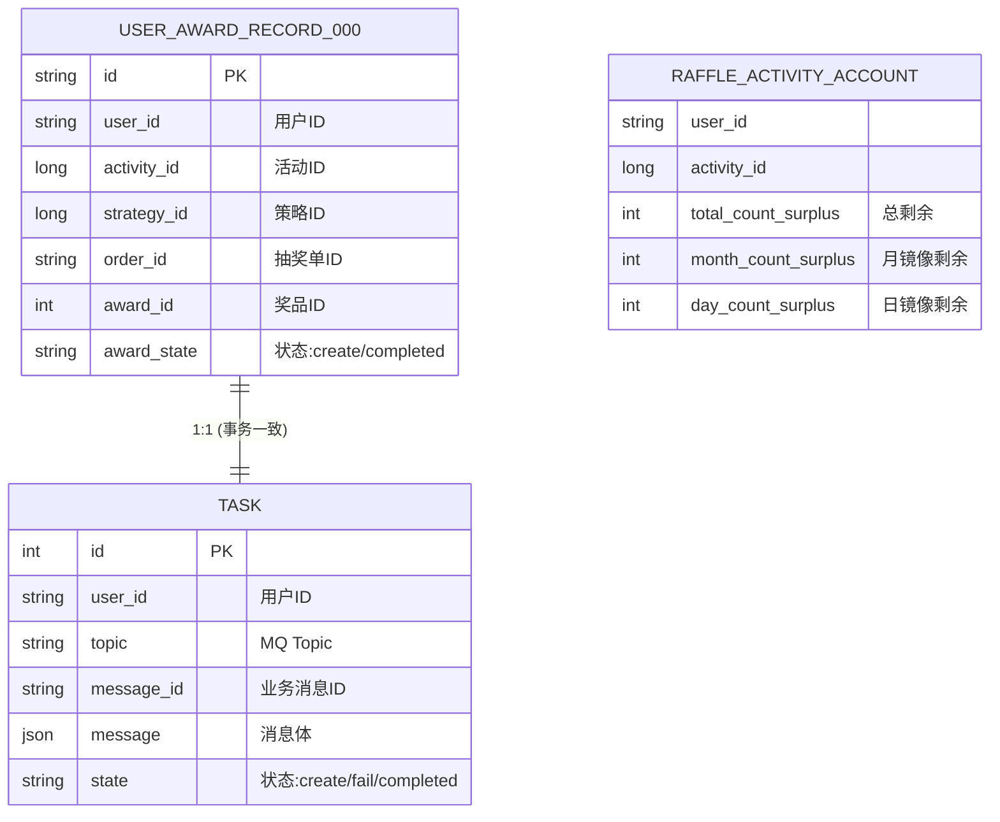

# 中奖记录与可靠消息投递 - 数据库设计

本模块的核心目标是确保持久化用户的中奖结果，并通过“本地消息表”模式保证发奖消息能可靠地投递到下游系统（如发奖服务）。

## 1. 实体关系图 (ER Diagram)

## 2. 表结构变更说明

### 2.1 任务表 (`task`)
本次提交对任务表进行了增强，使其成为标准的**本地消息表**。
*   **新增字段**: `user_id` (分库分表路由键), `message_id` (业务唯一键，防止重复), `topic`, `message`.
*   **用途**: 在保存用户中奖记录的同一个数据库事务中，写入该任务。如果 MQ 发送失败，会有定时任务扫描该表进行重试。

### 2.2 用户中奖记录表 (`user_award_record_000~003`)
*   **分库分表**: 依照 `user_id` 进行切分。
*   **状态管理**: `award_state` 记录奖品的发放状态。

### 2.3 活动账户表 (`raffle_activity_account`)
*   **镜像字段逻辑优化**: 在更新 `month`/`day` 子表额度时，显式同步更新主表中的镜像字段 `month_count_surplus` 和 `day_count_surplus`，确保数据视图的一致性。

## 3. 可靠性设计
*   **事务绑定**: `UserAwardRecord` 和 `Task` 的插入操作在同一个 `TransactionTemplate` 中执行。
*   **唯一约束**: `Task` 表的 `uq_message_id` 确保了同一个业务事件只会产生一条任务记录。
