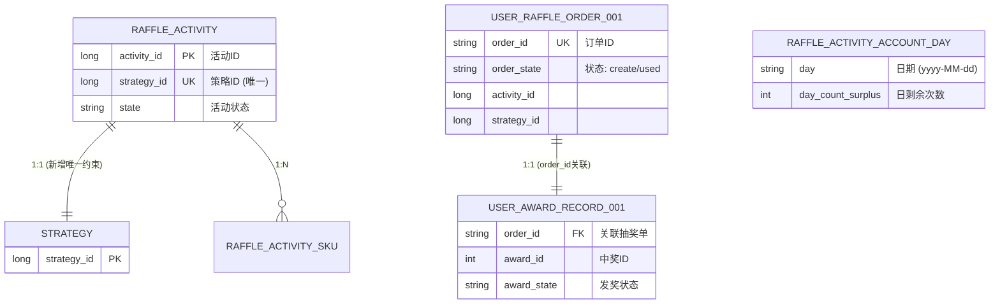

# 抽奖活动流程串联 - 数据库设计

本模块实现了完整的"活动抽奖"流程：从用户参与活动扣减额度，到执行抽奖策略，再到记录中奖结果，形成一个完整的业务闭环。

## 1. 实体关系图 (ER Diagram)

## 2. 核心变更说明

### 2.1 活动与策略唯一绑定 (`raffle_activity`)
*   **新增约束**: `UNIQUE KEY uq_strategy_id (strategy_id)`
*   **意义**: 确保一个策略只能关联一个活动，简化了从策略反查活动的逻辑，支持"次数锁"等规则查询用户今日参与次数。

### 2.2 抽奖单状态流转 (`user_raffle_order`)
*   **新增更新逻辑**: `updateUserRaffleOrderStateUsed` 
*   **状态机**: `create` (创建) -> `used` (已使用，执行完抽奖后更新)
*   **防重复抽奖**: 在写入中奖记录时，会原子性地将对应的 `order` 状态更新为 `used`，如果更新失败（如已被使用），事务回滚，防止重复抽奖。

### 2.3 按活动ID批量查询SKU (`raffle_activity_sku`)
*   **新增查询**: `queryActivitySkuListByActivityId`
*   **用途**: 在活动装配（预热）时，一次性加载该活动下的所有SKU配置到缓存中。

## 3. 数据一致性保障
*   **事务绑定**: 在 `AwardRepository` 中，`user_award_record` 的插入、`task` 的创建、以及 `user_raffle_order` 状态更新，均在同一个数据库事务中执行，确保了"中奖-任务-订单消费"的原子性。
