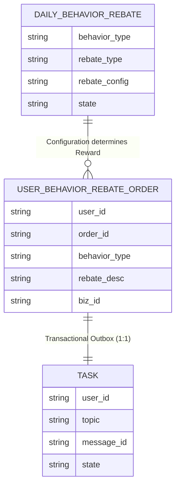

# 数据库表关系及字段变更分析

## 1. 日常行为返利活动配置表 (daily_behavior_rebate)

该表用于配置各种用户行为（如签到、支付）所能获得的返利内容（如SKU库存、积分）。

| 字段 | 类型 | 描述 | 说明 |
|---|---|---|---|
| id | INT | 自增ID | |
| behavior_type | VARCHAR | 行为类型 | 枚举值：`sign` (签到), `openai_pay` (支付) |
| rebate_desc | VARCHAR | 返利描述 | |
| rebate_type | VARCHAR | 返利类型 | 枚举值：`sku` (活动库存), `integral` (积分) |
| rebate_config | VARCHAR | 返利配置 | 具体的SKU编号或积分数值 |
| state | VARCHAR | 状态 | `open`/`close` |

**用途**：
当用户触发特定行为时，系统查询此表以确定用户应获得的奖励。

## 2. 用户行为返利流水订单表 (user_behavior_rebate_order)

该表用于记录用户行为触发的返利流水，采用分库分表设计 (`_000` - `_003`)。

| 字段 | 类型 | 描述 | 说明 |
|---|---|---|---|
| id | INT | 自增ID | |
| user_id | VARCHAR | 用户ID | 分库分表键 |
| order_id | VARCHAR | 订单ID | |
| behavior_type | VARCHAR | 行为类型 | 冗余自配置表 |
| rebate_desc | VARCHAR | 返利描述 | 冗余自配置表 |
| rebate_type | VARCHAR | 返利类型 | `sku` / `integral` |
| rebate_config | VARCHAR | 返利配置 | |
| biz_id | VARCHAR | 业务ID | **核心字段**，用于幂等控制。格式如 `userId_sign_20240430` |

**关系图谱**：

*   **逻辑说明**：
    1.  用户触发行为 -> 匹配 `DAILY_BEHAVIOR_REBATE`。
    2.  生成 `USER_BEHAVIOR_REBATE_ORDER` 记录流水。
    3.  同时在同事务中插入 `TASK` 表（消息发送任务）。
    4.  通过 `TASK` 异步/定时发送 MQ 消息通知下游服务（如积分系统或抽奖额度账户）。

## 3. 其他变更
*   **dbRouter**: 修正了任务调度中 `dbRouter.clear()` 的调用逻辑，防止上下文未清理或过度清理。
