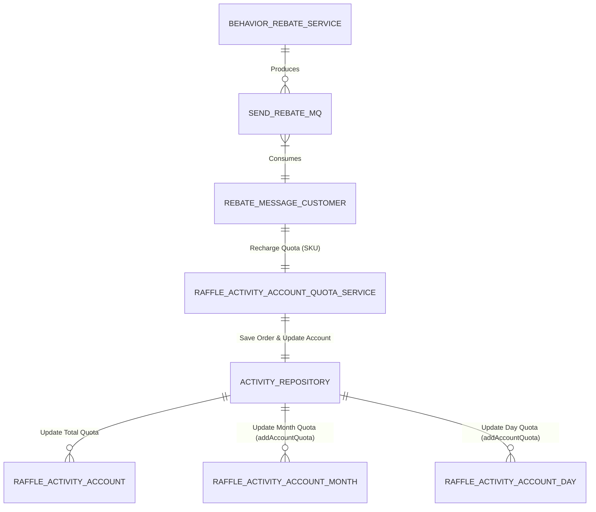

# 数据库表关系及字段变更分析

## 1. 抽奖活动账户月表 (raffle_activity_account_month)

*   **新增操作**: 增加了 `addAccountQuota` 更新语句。
*   **用途**: 当用户通过返利或充值增加总额度时，如果该额度同时也属于本月额度的一部分（通常充值额度也会更新到月度累计中），则通过此原子更新增加 `month_count_surplus` 和 `month_count`。

## 2. 抽奖活动账户日表 (raffle_activity_account_day)

*   **新增操作**: 增加了 `addAccountQuota` 更新语句。
*   **用途**: 同上，用于同步增加当日的额度记录。

## 3. 关系图谱更新

**说明**:
*   本次核心链路在于消息消费后的**额度入账**。
*   入账操作不仅仅更新总账户 (`raffle_activity_account`)，现在还会级联更新日账户 (`_day`) 和月账户 (`_month`) 的镜像额度，确保各维度数据一致性。
