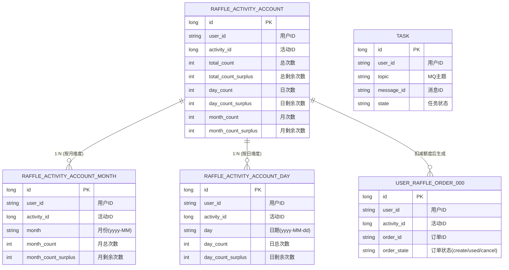

# 活动参与模块 - 数据库表关系

本设计主要服务于用户参与活动时的业务处理，核心包含：活动账户录入（总、月、日）、分库分表的用户抽奖订单、以及保证最终一致性的任务表。

## 1. 实体关系图 (ER Diagram)

## 2. 表结构说明

### 2.1 抽奖活动账户表 (`raffle_activity_account`)
记录用户在某个活动上的总账户信息，同时作为所有额度（总、月、日）的聚合根。
*   **镜像额度设计**：字段 `day_count_surplus`和`month_count_surplus` 是 `raffle_activity_account_day` 和 `raffle_activity_account_month` 表中当天的/当月的剩余额度的镜像。
*   **用途**：在参与活动扣减库存时，首先校验总账户额度。

### 2.2 账户月额度表 (`raffle_activity_account_month`)
记录用户在特定月份的额度使用情况。
*   **主键逻辑**：`user_id` + `activity_id` + `month` 唯一标识。
*   **业务逻辑**：如果用户当月第一次参与，会先插入一条记录；如果已存在，则扣减 `month_count_surplus`。

### 2.3 账户日额度表 (`raffle_activity_account_day`)
记录用户在特定日期的额度使用情况。
*   **业务逻辑**：通过 `day` 字段控制每日参与上限。

### 2.4 用户抽奖订单表 (`user_raffle_order_000~003`)
**分库分表设计**：
*   该表记录用户参与活动产生的“入场券”。
*   数据量巨大，因此采用分库分表策略（如 `user_id % n`）。
*   **状态流转**：
    *   `create`: 订单创建，额度已扣减，等待抽奖。
    *   `used`: 已使用，用户已执行抽奖。
    *   `cancel`: 已作废（如超时未支付/未抽奖等场景，通常本表主要关注创建和使用）。

### 2.5 任务表 (`task`)
**可靠性保障**：
*   用于实现本地消息表模式（Local Transaction Table）。
*   在生成订单或发送MQ消息失败时，通过定时任务扫描该表进行补偿重试，确保业务流程的最终一致性。

## 3. 分库分表策略
*   **路由键**：`user_id`
*   **场景**：
    *   `user_raffle_order`：根据用户ID路由到不同的库表，缓解单表压力。
    *   `user_award_record`：用户中奖记录同样采用分表设计。
