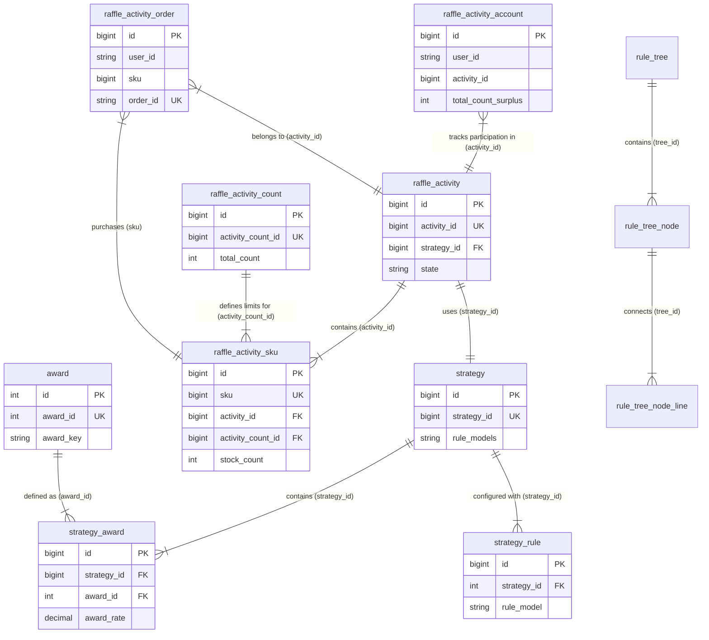

# Big Market 数据库设计文档

## 1. 数据库概览

本项目包含三个主要数据库脚本，分别对应核心配置库和分库分表的用户数据库：

- **big_market**: 核心配置库，包含活动、策略、奖品、规则等配置信息。
- **big_market_01 / big_market_02**: 用户数据库（分库），包含用户活动账户、活动订单等数据。通常用于水平扩容。

## 2. 核心领域模型与关系

### 2.1 抽奖策略领域 (Strategy Domain)

该领域负责定义抽奖的规则、概率及奖品配置。

*   **strategy** (抽奖策略): 定义策略元信息，如策略ID、描述、引用的规则模型。
    *   关联关系: 
        *   `strategy_id` 被 `raffle_activity` 引用。
*   **strategy_award** (抽奖策略奖品): 定义策略下的奖品配置，包括库存、概率、排序等。
    *   关联关系: 
        *   `strategy_id` 关联 `strategy.strategy_id`。
        *   `award_id` 关联 `award.award_id`。
*   **strategy_rule** (抽奖策略规则): 定义策略级别的具体规则（如权重、黑名单等）。
    *   关联关系: 
        *   `strategy_id` 关联 `strategy.strategy_id`。
*   **award** (奖品表): 定义奖品的基础信息。
    *   关联关系: 
        *   `award_id` 被 `strategy_award` 引用。

### 2.2 抽奖活动领域 (Activity Domain)

该领域负责定义具体的运营活动、参与时间和库存Sku。

*   **raffle_activity** (抽奖活动表): 定义活动的基本信息、生效时间及使用的策略。
    *   关联关系:
        *   `strategy_id` 关联 `strategy.strategy_id`。
*   **raffle_activity_sku** (抽奖活动SKU表): 定义活动的可售卖/参与单元，绑定活动与参与次数配置。
    *   关联关系:
        *   `activity_id` 关联 `raffle_activity.activity_id`。
        *   `activity_count_id` 关联 `raffle_activity_count.activity_count_id`。
*   **raffle_activity_count** (抽奖活动次数配置表): 定义不同SKU对应的活动参与次数（总/日/月）。
    *   关联关系:
        *   `activity_count_id` 被 `raffle_activity_sku` 引用。

### 2.3 规则引擎领域 (Rule Engine Domain)

该领域通过树形结构定义复杂的规则执行流程。

*   **rule_tree** (规则树): 定义规则树的根信息。
*   **rule_tree_node** (规则树节点): 定义树中的具体规则节点（如锁定、库存扣减、兜底奖励）。
    *   关联关系: `tree_id` 关联 `rule_tree.tree_id`。
*   **rule_tree_node_line** (规则树连线): 定义节点之间的连接关系及流转条件。
    *   关联关系: `tree_id`、`rule_node_from`、`rule_node_to`。

### 2.4 用户交易领域 (User Transaction Domain - Sharded)

该领域记录用户的实际参与行为，通常进行分库分表处理。

*   **raffle_activity_account** (抽奖活动账户表): 记录用户在特定活动下的剩余参与次数。
    *   关联关系:
        *   `activity_id` 逻辑关联 `raffle_activity.activity_id`。
*   **raffle_activity_order_{000..003}** (抽奖活动订单表): 记录用户的活动参与订单。
    *   关联关系:
        *   `sku` 逻辑关联 `raffle_activity_sku.sku`。
        *   `activity_id` 逻辑关联 `raffle_activity.activity_id`。
        *   `strategy_id` 逻辑关联 `strategy.strategy_id`。

## 3. 数据库ER关系图 (Mermaid)

## 4. 表结构详情

### 4.1 核心配置库 (big_market)

#### award (奖品表)
| 字段 | 类型 | 说明 |
|---|---|---|
| id | int(11) | 自增ID |
| award_id | int(8) | 奖品ID |
| award_key | varchar(32) | 奖品对接标识 |
| award_config | varchar(32) | 奖品配置信息 |
| award_desc | varchar(128) | 奖品内容描述 |

#### raffle_activity (抽奖活动表)
| 字段 | 类型 | 说明 |
|---|---|---|
| id | bigint(11) | 自增ID |
| activity_id | bigint(12) | 活动ID |
| activity_name | varchar(64) | 活动名称 |
| begin_date_time | datetime | 开始时间 |
| end_date_time | datetime | 结束时间 |
| strategy_id | bigint(8) | 抽奖策略ID |
| state | varchar(8) | 活动状态 |

#### raffle_activity_sku (抽奖活动SKU)
| 字段 | 类型 | 说明 |
|---|---|---|
| sku | bigint(12) | 商品sku |
| activity_id | bigint(12) | 活动ID |
| activity_count_id | bigint(12) | 活动个人参与次数ID |
| stock_count | int(11) | 商品库存 |
| stock_count_surplus | int(11) | 剩余库存 |

#### strategy (抽奖策略)
| 字段 | 类型 | 说明 |
|---|---|---|
| strategy_id | bigint(8) | 抽奖策略ID |
| strategy_desc | varchar(128) | 抽奖策略描述 |
| rule_models | varchar(256) | 规则模型 |

#### strategy_award (抽奖策略奖品)
| 字段 | 类型 | 说明 |
|---|---|---|
| strategy_id | bigint(8) | 抽奖策略ID |
| award_id | int(8) | 抽奖奖品ID |
| award_count | int(8) | 奖品库存总量 |
| award_rate | decimal(6,4) | 奖品中奖概率 |

---

### 3.2 用户数据库 (big_market_01/02)

#### raffle_activity_account (活动账户)
| 字段 | 类型 | 说明 |
|---|---|---|
| user_id | varchar(32) | 用户ID |
| activity_id | bigint(12) | 活动ID |
| total_count | int(8) | 总次数 |
| total_count_surplus | int(8) | 剩余总次数 |
| day/month_count... | int(8) | 日/月次数配置及剩余 |

#### raffle_activity_order (活动订单 - 分表)
| 字段 | 类型 | 说明 |
|---|---|---|
| user_id | varchar(32) | 用户ID |
| sku | bigint(12) | 商品sku |
| activity_id | bigint(12) | 活动ID |
| order_id | varchar(12) | 订单ID |
| state | varchar(16) | 订单状态 |
