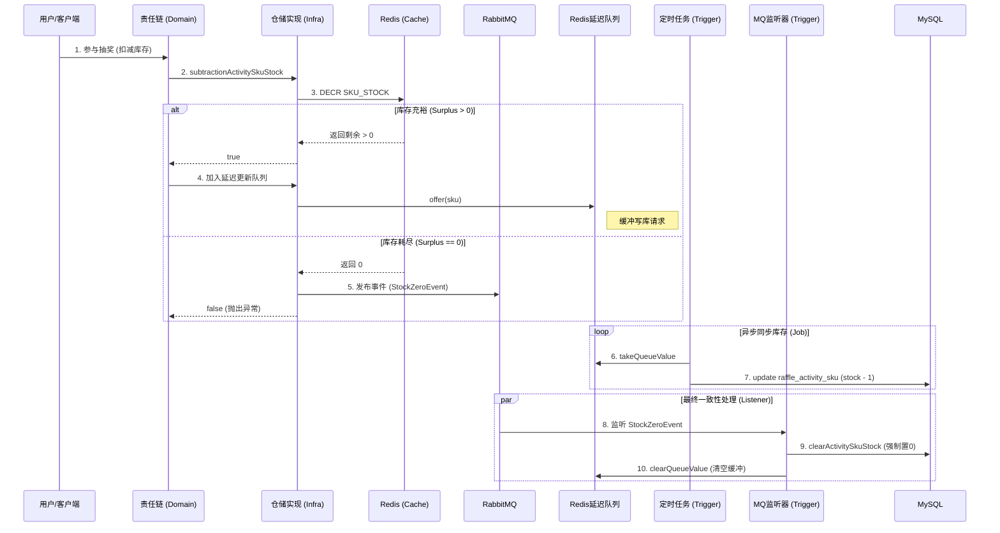

# DDD 架构中的消息队列与库存一致性设计分析

根据 `commit ccdd6d82a57bf9c505e7712428104af0872807f2` 的提交记录，本项目（Big Market）在引入消息队列（RabbitMQ）处理活动 SKU 库存一致性时，严格遵循了 DDD（领域驱动设计）的分层架构原则。

本文档将分析该功能的架构设计、分层职责以及核心业务流程。

## 1. 业务背景与设计目标

在高并发的抽奖/秒杀场景下，直接操作数据库扣减库存会造成严重的性能瓶颈。为了解决这个问题，系统采用了 **"Redis 预热 + 设置库存 + 延迟队列异步更新数据库 + MQ 最终一致性"** 的方案。

*   **高性能**: 库存扣减在 Redis 中进行 (`decr`)。
*   **高可用/削峰**: 通过延迟队列缓冲数据库的更新压力。
*   **一致性**: 当 Redis 库存耗尽时，通过 MQ 领域事件通知系统清空数据库库存，确保状态闭环。

## 2. DDD 分层架构实现

### 2.1 领域层 (Domain Layer)

领域层负责定义业务的核心逻辑、规则和事件，**不依赖具体的 MQ 客户端实现**。

*   **领域事件 (Domain Event)**: 
    *   定义了 `ActivitySkuStockZeroMessageEvent`（活动SKU库存清空消息）。这代表了业务领域中发生的一个关键状态变更（库存归零）。
    *   事件继承自 `BaseEvent`，包含事件 ID、时间戳、业务数据 (SKU) 等。
*   **值对象 (Value Object)**:
    *   `ActivitySkuStockKeyVO`: 封装了 SKU 和 ActivityID，作为传递给队列的数据结构。
*   **领域服务 (Domain Service)**:
    *   `RaffleActivityService`: 实现了 `ISkuStock` 接口，编排库存扣减流程。
    *   在 `ActivitySkuStockActionChain`（责任链模式）中，执行 Redis 库存扣减逻辑。
    *   **关键逻辑**: 如果 Redis 扣减成功，将更新任务写入 **Redis 延迟队列**（非 RabbitMQ，用于缓冲写库）；如果 Redis 返回库存为 0，则表明库存耗尽。
*   **仓储接口 (Repository Interface)**:
    *   `IActivityRepository`: 定义了库存相关的抽象操作，如 `subtractionActivitySkuStock` (扣减)、`activitySkuStockConsumeSendQueue` (发送缓冲队列)、`cacheActivitySkuStockCount` (缓存预热)。

### 2.2 基础设施层 (Infrastructure Layer)

基础设施层负责**具体的中间件技术实现**，包括 Redis 操作和 RabbitMQ 消息发送。

*   **消息发布者 (Event Publisher)**:
    *   `EventPublisher`: 封装 `RabbitTemplate`，将领域层定义的 `BaseEvent` 序列化为 JSON 并发送到 RabbitMQ。这是领域事件发布的具体适配器。
*   **仓储实现 (Repository Implementation)**:
    *   `ActivityRepository`: 实现了 Domain 层的 `IActivityRepository`。
    *   **Redis 原子性操作**: 使用 `lua` 脚本或 `redisson` 的原子操作 (`decr`, `getAtomicLong`) 执行库存扣减。
    *   **触发领域事件**: 在 `subtractionActivitySkuStock` 方法中，当检测到 `decr` 后的值为 0 时，调用 `eventPublisher.publish()` 发送 `activity_sku_stock_zero` 消息到 RabbitMQ。
    *   **Redis 延迟队列**: 使用 Redisson 的 `RDelayedQueue` 实现缓冲队列，用于延时异步更新 MySQL。

### 2.3 触发层 (Trigger Layer)

触发层（接口层/用户接口层）负责**响应外部请求或监听内部消息**，驱动应用逻辑执行。

*   **MQ 监听器 (Listener)**:
    *   `ActivitySkuStockZeroCustomer`: 监听 RabbitMQ 的 `activity_sku_stock_zero` Topic。
    *   **职责**: 收到库存归零消息后，调用应用服务清空数据库中的库存，并清空 Redis 延迟队列。这是为了确保“最终一致性”，防止后续还有延迟任务更新旧的库存数据。
*   **定时任务 (Job)**:
    *   `UpdateActivitySkuStockJob`: 定时从 Redis 延迟队列 (`takeQueueValue`) 中获取任务。
    *   **职责**: 缓慢、平滑地将 Redis 的库存变动同步回 MySQL (`skuStock.updateActivitySkuStock`)，避免数据库瞬时写压力过大。

## 3. 核心业务流程图解



## 4. 关键代码片段分析

### 4.1 发送领域事件 (Infrastructure)
位于 `cn.bugstack.infrastructure.persistent.repository.ActivityRepository`：

```java
@Override
public boolean subtractionActivitySkuStock(Long sku, String cacheKey, Date endDateTime) {
    long surplus = redisService.decr(cacheKey);
    if (surplus == 0) {
        // 库存消耗没了以后，发送MQ消息，更新数据库库存
        eventPublisher.publish(activitySkuStockZeroMessageEvent.topic(), activitySkuStockZeroMessageEvent.buildEventMessage(sku));
        return false;
    } 
    // ... 省略加锁逻辑
}
```

### 4.2 消费领域事件 (Trigger)
位于 `cn.bugstack.trigger.listener.ActivitySkuStockZeroCustomer`：

```java
@RabbitListener(queuesToDeclare = @Queue(value = "activity_sku_stock_zero"))
public void listener(String message) {
    // ... 解析消息
    Long sku = eventMessage.getData();
    // 更新数据库库存为0
    skuStock.clearActivitySkuStock(sku);
    // 清空延迟队列，不再处理之前的积压更新
    skuStock.clearQueueValue();
}
```

## 5. 总结

在本次提交中，架构设计的亮点在于：

1.  **读写分离与动静分离**: 抽奖流程（读/算）主要依赖 Redis，只有异步同步任务才写 MySQL。
2.  **双重保障机制**: 
    *   **正常流量**: 使用 Redis 延迟队列平滑同步库存。
    *   **临界流量**: 使用 RabbitMQ 广播“售罄”信号，强制同步状态，防止超卖或状态不一致。
3.  **清晰的 DDD 边界**: 业务逻辑在 Domain 层闭环，具体的消息中间件实现细节封装在 Infrastructure 层，由 Trigger 层负责驱动执行。这种设计使得业务逻辑不被技术细节（如 RabbitMQ API）污染。
